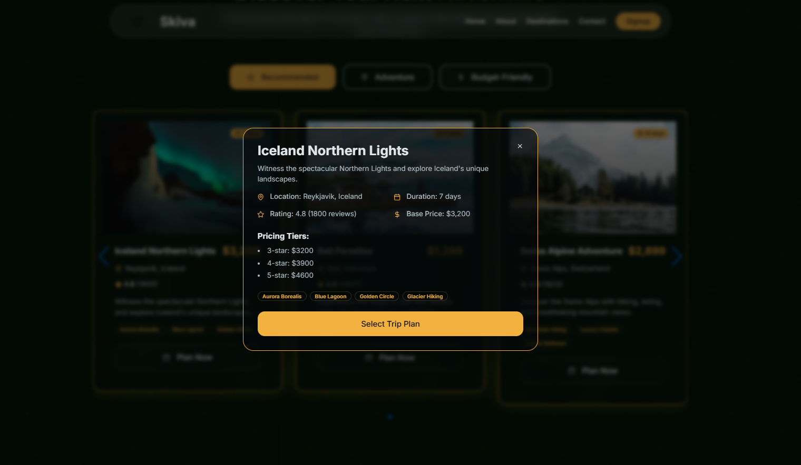

Skiva - Your Gateway to Extraordinary Journeys
Welcome to Skiva, where the pursuit of travel transcends the ordinary. 
This project embodies a vision of luxurious, sustainable, and accessible travel for all, presented through a sleek, modern, and highly interactive web experience.
Skiva is designed to inspire, inform, and guide you to your next unforgettable adventure, blending cutting-edge web technologies with a refined aesthetic.
✨ Live Demo
Experience Skiva live on Vercel:
https://skiva.vercel.app/

## 🚀 Features & Highlights

- **Luxurious & Modern UI**: A glassmorphic design language infused with a bespoke **golden palette**, creating a sense of elegance and wanderlust.
- **Animated Hero Section**: Featuring a starfield animation, background image, and a typewriter effect for rotating inspirational travel phrases.
- **Responsive Design**: Beautiful on all screen sizes — desktop, tablet, and mobile.
- **Interactive Trip Guides**: Filterable carousel with glow-bordered cards. Each opens a detailed trip modal.
- **Elegant Contact Form**: Golden glowing form powered by Formspree.
- **Smooth Animations**: Using Framer Motion and custom CSS animations like `pulse-glow` for UI finesse.
- **Performance Optimized**: Lazy loading, `will-change` hints, and memoized components keep it fast and responsive.
- **Glassmorphic Header**: A fixed, floating nav bar with smooth-scroll anchors and a glowing "Signup" button.

📸 Screenshots & Features Overview
Section	Preview (File Name)	Description
Home (Hero)		Starfield background, animated typewriter intro, and CTA search bar
About		Glassmorphic content showcasing values and customer testimonials
Trip Guides		Swiper carousel of trip cards with glowing golden borders
Trip Details Modal		Interactive modal with trip descriptions, pricing tiers, and highlights
Contact		Elegant contact form with glow effects, powered by Formspree
Login / Signup		Glassmorphic modals for user authentication (signup & login)                         |

🛠️ Tech Stack

| Layer      | Technology                                                                 |
|------------|-------------------------------------------------------------------------------|
| **Frontend** | React.js, TypeScript, Tailwind CSS, Vite, Framer Motion, Swiper.js         |
| **UI/UX**     | Shadcn/ui, Custom CSS Keyframes, Glassmorphism Design                     |
| **Icons**     | Lucide React                                                              |
| **Forms**     | [Formspree](https://formspree.io)                                         |
| **Hosting**   | [Vercel](https://vercel.com)                                              |

🎨 Creative Direction & Implementation Highlights
Design Language:
Skiva embraces glassmorphism and a luxurious golden palette, using blurred transparency and warm tones (--primary, --accent, --glow) across UI for an elegant, futuristic feel.

Header & Navigation:
A fixed, floating header (top-4 left-1/2) with backdrop-blur-md and rounded-full integrates a glowing "Signup" button that triggers the LoginSignupModal.

Buttons & Interactions:

variant="glass" buttons follow the glassmorphic design.

Main CTA (.explore-button) uses a soft pulse-glow animation (custom box-shadow, scale) for subtle attraction.

Visual Elements:

Starfield background (Hero): Pure CSS box-shadow animation brings depth.

bg-tech-lines SVG adds subtle motion and texture across sections.

Motion & Animation:

Framer Motion enables smooth transitions for modals, sections, and cards.

Custom @keyframes (pulse-glow, typing, blink-caret) enhance polish.

Forms & Backend:
The Contact Form uses Formspree for backend-free email handling.

Component System:

shadcn/ui components customized with Tailwind CSS ensure visual consistency.

Lucide icons integrate smoothly into the golden theme.

Typewriter Intro:
A custom useEffect hook animates typewriter text in the Hero for dynamic engagement.

Performance Enhancements:

Components like TripCard use memo to prevent re-renders.

Sections (About, Guides, Contact) are lazy-loaded for faster loads.

will-change: transform, opacity; improves animation smoothness via GPU hints.

To run this project locally:

Clone the repository:

git clone https://github.com/Anamitraroy22/Skiva.git
cd Skiva

Install dependencies:

npm install
# or
yarn install

Start the development server:

npm run dev
# or
yarn dev

## 🤝 Contributing
We welcome your ideas, pull requests, and improvements! Feel free to open an issue or PR.

---

## 📄 License
MIT License — Developed with ❤️ by **Anamitra Roy**
